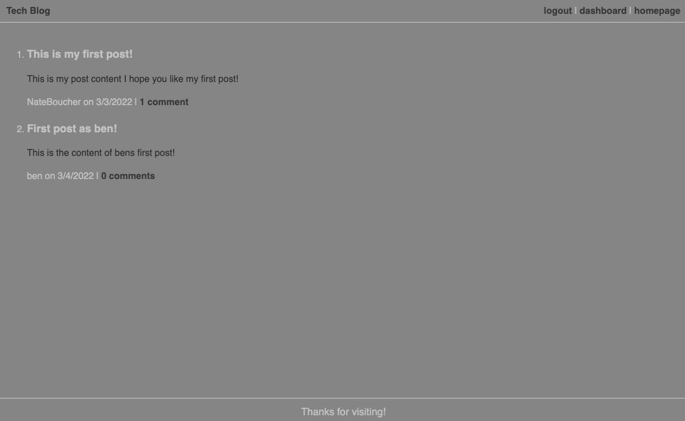

# Tech Blog | 

## About the Project:
    
CMS Style blog for users in the tech industry to share information.

## Deployment Link:

## Screenshot:

    
## Table of Contents
    
- [Installation](#installation)
- [Usage](#usage)
- [Questions](#questions)

## Installation:
    
Follow deployment URL to interact.

## Usage Information:
    
At the home page navigate to login and signup for the site. On the user dashboard you can create posts and edit existing ones. 

## Questions?

Contact me via [Github](https://github.com/natejboucher.com) or Email: <natejboucher@gmail.com>
